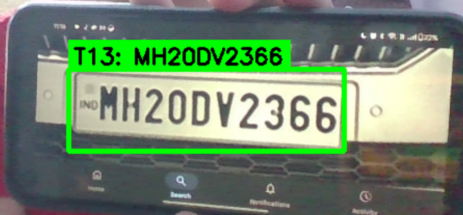
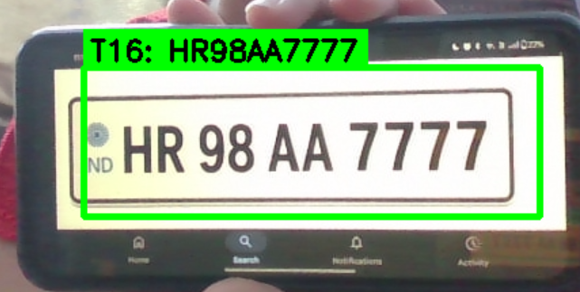
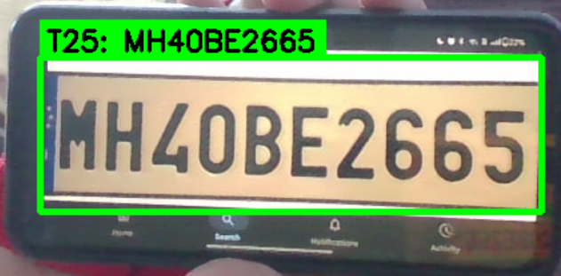
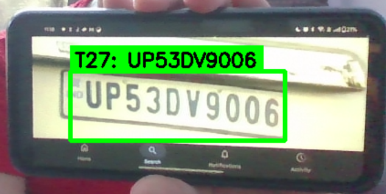
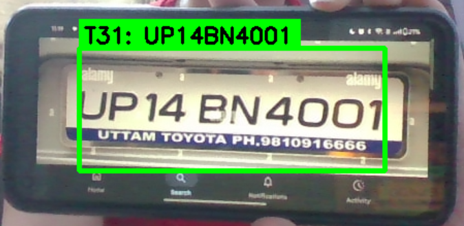
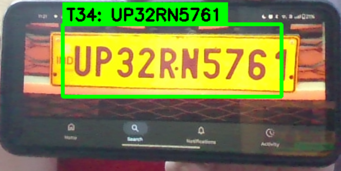

# ANPR - Automatic Number Plate Recognition

Real-time license plate detection and recognition system for Indian vehicles using **YOLO** (for detection) and **TrOCR** (for OCR).


## Installation

1. **Clone the repository**
```bash
git clone https://github.com/JainishaPathak/anpr_.git
cd anpr


2. **Create virtual environment**

```bash
python -m venv venv
```

3. **Activate virtual environment**

```bash
# Windows
venv\Scripts\activate

# Linux/Mac
source venv/bin/activate
```

4. **Install dependencies**

```bash
pip install -r requirements.txt
```

5. **Download required files**

* Place model weights: `license_plate_detector.pt` in `weights/` folder
* Test video: [Download here](https://drive.google.com/file/d/1RPky7aKlF7lHwx7NkwSdsb0J8X07tT-r/view?usp=sharing)
* Place the video in `videos/` folder

---

## Usage

**Process a video file**

```bash
python main.py --video videos/input_video_3.mp4
```

**Use webcam**

```bash
python main.py --video webcam
```

## Demo Results

### Sample Outputs from Webcam Inference

<p align="center">
  
  
</p>

<p align="center">
  
  
</p>

<p align="center">
  
 
</p>

<p align="center">
  
</p>

---

## Output

* `output/videos/` → Annotated videos with bounding boxes
* `output/logs/` → Detection logs with timestamps
* `output/detected_plates/` → Cropped plate images

---

## Requirements

* Python 3.8+
* CUDA-compatible GPU (recommended for real-time performance)


